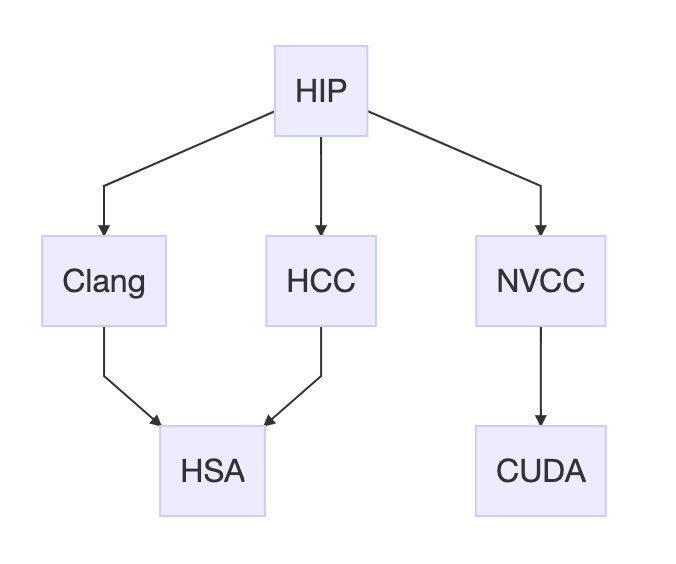

# 1. CUDA到HIP转码
本项目分析CUDA到HIP转码的实现机制，提供一套较完善的CUDA到HIP代码转换的工具，包含及时更新版本的hipify-perl脚本和部分补充脚本。

## CUDA与HIP
CUDA是NVIDIA开发的GPU SDK（软件开发框架），主要针对NVIDIA GPU硬件开发，而HIP是AMD开发的GPU SDK，主要是针对AMD GPU硬件开发，同时兼容NVIDIA GPU硬件上的开发。试想AMD为何会如此雄心壮志？其实是无奈之举。显然当今CUDA的生态处于绝对优势（dominant），AMD要想迎头赶上，必须兼容CUDA。如何实现兼容CUDA？答案就是利用HIP。

HIP（Heterogeneous-Computing Interface for Portability）实际上就是构造异构计算的接口，一方面对接AMD HCC（Heterogeneous Compute Compiler），另一方面对接CUDA NVCC。HIP位于HCC和NVCC的上层（或者说在HC和CUDA的上层），HIP的API接口与CUDA API接口类似，但不完全相同。CUDA代码需要通过转码改写为HIP形式才可以在AMD GPU上编译运行，AMD编译环境称为ROCm（Radeon Open Compute Platform），早期使用HCC/HC模式，而今主要发展基于Clang和LLVM开发的编译器，实际上命令行在Clang模式下，hcc就是alias到clang命令。我们都知道Clang+LLVM是一个开源的编译器框架，除了支持C/C++编译，也支持[CUDA的编译](https://llvm.org/docs/CompileCudaWithLLVM.html#compiling-cuda-code)。AMD将Clang+LLVM进行扩展形成HIP的底层编译器，以支持AMD GPU编译。实际上在ROCm环境，HIP有三种平台模式（通过环境变量HIP_PLATFORM区别）：clang、hcc和nvcc。而HIP提供的hipcc命令，实质是一个perl脚本，通过HIP_PLATFORM等环境变量，调用不同的底层编译器，实现统一编译模式。



## HIP转码的实现
如果你留意，可以发现ROCm的HIP项目中提供了一个[hipify-clang](https://github.com/ROCm-Developer-Tools/HIP/tree/master/hipify-clang)的工具。这个hipify-clang工具是基于Clang编译器的[抽象语法树](https://clang.llvm.org/docs/IntroductionToTheClangAST.html)和[重构引擎](https://clang.llvm.org/docs/RefactoringEngine.html)机制，实现CUDA到HIP的API函数名和type名的重命名和include头文件名的替换（详见下一节分析），理论上是最可靠的一种代码转换方式。因为字面意思的文本转换难以区分API语义，如分别函数名还是参数名。

hipify-clang从根本上可以解决CUDA到HIP的转码，但不等于说没有困难，困难在于CUDA的版本很多，各版本之间也有不兼容的API问题，而且CUDA少量函数或变量名，在HIP底层并没有实现对应体。

但总的来说，AMD的伙计们还是很给力，不断在更新hipify-clang，也支持最新CUDA 10.1的API转换。基于hipify-clang工具还可以生成perl转码的map文件或python转码的map文件，这里的map文件实质就是转码函数或变量名的映射代码行。一般hipify-clang是随着ROCm环境一起安装的，没法及时更新。导致hipify-clang的新功能没法应用。

HIP项目的[bin目录](https://github.com/ROCm-Developer-Tools/HIP/tree/master/bin)中提供了一个名为hipify-perl的可执行的脚本，借助perl语言定义了CUDA到HIP转码的主体框架以及转换名称的map内容，这个map内容实际上是由hipify-clang工具生成。更新了hipify-clang工具，也应该更新hipify-perl脚本。但hipify-clang工具需要Clang+LLVM的SDK环境，这是一个较复杂的开发软件环境，一般用户难以驾驭，导致编译hipify-clang有困难。不过，本项目中直接提供了最新的hipify-perl脚本。

## hipify-clang代码简介
[hipify-clang](https://github.com/ROCm-Developer-Tools/HIP/tree/master/hipify-clang)作为HIP的一个子模块而存在，官方代码文件见 https://github.com/ROCm-Developer-Tools/HIP/tree/master/hipify-clang ，理解其需要一些Clang和LLVM知识背景。相关代码文件简介如下：

- **main.cpp** 入口函数main的定义文件。
  首先完成命令行参数解析，支持Perl和Python的map导出（见其中的generatePerl和generatePython两个函数），对每个输入待转码的文件，会创建RefactoringTool和actionFactory对象，并填充相应的Clang RefactoringTool的工作参数，最终构建出Clang refactoring的基本框架，核心在于执行`Tool.runAndSave(&actionFactory)`启动整个重构的工作流程，其中会调用重载的HipifyAction类中定义的转码函数。

- **ArgParse.cpp/.h** 定义命令行参数的解析。
  在main函数中被调用。

- **ReplacementsFrontendActionFactory.h** 定义一个基于`clang::tooling::FrontendActionFactory`的工厂类。
  main中实例化为对象actionFactory，供`Tool.runAndSave`函数调用。

- **LLVMCompat.cpp/.h** 新建了命令空间llcompat和定义版本兼容函数。
  其中定义兼容不同版本的各类函数，包括SourceLocation的begin和end定位函数、getReplacements函数、insertReplacement函数和EnterPreprocessorTokenStream函数等等。

- **CUDA2HIP.cpp/.h** 定义转码映射关系对象。
  定义了两个`std::map<llvm::StringRef, hipCounter>`类型的数据对象CUDA_RENAMES_MAP和CUDA_INCLUDE_MAP。在CUDA到HIP转码时，函数名和type名的转码映射关系定义在CUDA_RENAMES_MAP中，它们又由CUDA2HIP_XXX_API_functions.cpp和CUDA2HIP_XXX_API_types.cpp中定义的子类map组合而来。
 头文件名替换映射关系定义在CUDA_INCLUDE_MAP中。

- **HipifyAction.cpp/.h** 定义了HipifyAction类。
  HipifyAction类继承了`clang::ASTFrontendAction`和`clang::ast_matchers::MatchFinder::MatchCallback`接口，实现基于Clang前端解析重命名机制的行为。这里是实现转码的重心之处。函数名和type名转码的重命名操作在RewriteToken函数中完成。HipifyAction的关键函数体结构为

```cpp
void HipifyAction::ExecuteAction() { //重载ASTFrontendAction的接口函数
 while (RawTok.isNot(clang::tok::eof)) {
    RewriteToken(RawTok); //调用自定义函数，执行CUDA_RENAMES_MAP替换。
    RawLex.LexFromRawLexer(RawTok);
  }
  // Register yourself as the preprocessor callback, by proxy.
  // 自定义预处理阶段的回调函数，跳转调用hipifyAction的InclusionDirective和PragmaDirective函数
  // InclusionDirective函数完成CUDA_INCLUDE_MAP替换。
  PP.addPPCallbacks(std::unique_ptr<PPCallbackProxy>(new PPCallbackProxy(*this)));
  // Now we're done futzing with the lexer, have the subclass proceeed with Sema and AST matching.
  clang::ASTFrontendAction::ExecuteAction();//完成基类的操作
}

void HipifyAction::run(const clang::ast_matchers::MatchFinder::MatchResult& Result) {//重载MatchCallback的接口函数
  if (cudaLaunchKernel(Result)) return; //调用自定义函数
  if (cudaSharedIncompleteArrayVar(Result)) return;//调用自定义函数
}
```
 其中cudaLaunchKernel实现CUDA `kernel<<<*>>>` 函数的替换。cudaSharedIncompleteArrayVar实现 CUDA `__shared__`变量定义的重构，即添加HIP_DYNAMIC_SHARED宏包装。

- **Statistics.cpp/.h** 定义转码统计类，按子类型计数，便于最后输出统计结果。
- **StringUitils.cpp/.h** 定义String辅助操作的类。
  
另外在HIP项目的tests目录，有hipify-clang的单元测试文件，可以作为hipify-clang和hipify-perl的测试输入文件。如
- tests/hipify-clang/unit_tests/headers/headers_test_10.cu                   
- tests/hipify-clang/unit_tests/headers/headers_test_11.cu                   
- tests/hipify-clang/unit_tests/libraries/cuRAND/poisson_api_example.cu  

## hipify-perl程序简介
hipify-perl是HIP项目提供的一个CUDA到HIP转码的perl脚本，官方代码文件见 https://github.com/ROCm-Developer-Tools/HIP/blob/master/bin/hipify-perl ，本质上是基于文本字符串替换方式进行CUDA到HIP转码的关键字替换，包括类型名和函数名等替换。hipify-perl中的关键字替换的map可以从hipify-clang导出，hipify-perl提供了一个转码的框架。

# 2. 使用说明

本项目中，主要文件简介：
- hipify-perl
  基于hipify-clang最新map内容的版本
- hipify-cmakefile
  处理cmake文件(如CMakeList.txt)转码的脚本
- cuda2hip.sh
  调用hipify-perl实现文件夹的转码
- cuda2hip.sed 
  供sed调用的脚本文件，补充hipify-perl没有实现的关键字转码
- cuda2hipsed.sh 
  调用hipify-perl和sed脚本实现文件夹的转码

CUDA到HIP转码通常基于hipify-clang或hipify-perl。
- 直接使用hipify-clang进行代码转换，理论上hipify-clang是最准确的转码方式，但是它基于编译过程，对软件编译头文件有强烈依赖，容易导致编译过程中断，对转码产生一定影响。
- 还有一种折中的办法，是使用hipify-clang的输出map更新hipify-perl脚本。先用hipify-perl脚本进行主体转换，再用cuda2hip.sed脚本补充转换。应用这两个脚本转换之后，转码成功率相对高些。

## hipify-clang
```
./hipify-clang --help
./hipify-clang --cuda-path=/usr/local/cuda-10.0 -I /usr/local/cuda-10.0/samples/common/inc lib/*.cu
```
hipify-clang是基于Clang+LLVM SDK编译的二进制可执行文件。需要在Clang+LLVM的环境下编译获得，这个环境可以是LLVM官方版本，也可以是ROCm下LLVM分支版本（主要使用Clang前端API区别不大）。这里的CUDA头文件版本，需要与编译Clang时的一致，-I指定编译过程中搜索的include头文件目录，可能需要指定多个路径，便于hipify-clang对代码的扫描-编译-转码过程顺利通过。

## hipify-perl

```
./hipify-perl <file>
```
`<file>`为待转换的CUDA代码文件名。程序在转码之后会检验代码是否还包含cuda、cublas和curand等字眼，如果存在则给出警告（warning）提示，这些警告需要我们确认是否需要转码。

## cuda2hip.sh

```
./cuda2hip.sh <dir>
```
调用hipify-perl脚本进行文件夹内所有代码转换。默认通配`*.c*`、`*.h*`和`*.inl`文件（下同）。 
`<dir>`为待转换的CUDA代码所在目录名，可以使用空格隔空，输入多个文件目录名。

## cuda2hip.sed

- 第一种使用方式
```
./cuda2hip.sed <files>
```
`<files>`为待转换的CUDA代码文件名，可使用Shell通配符。
结果输出到标准输出端。

- 第二种使用方式
```
sed -i -f cuda2hip.sed <files>
```
`<files>`为待转换的CUDA代码文件名，可使用Shell通配符。`-i`表示in-place替换。

- 第三种使用方式
```
find . -type f -name *.c* -o -name *.h* -o -name *.inl |xargs sed -i -f cuda2hip.sed
```
这里借助find查找C/C++和CUDA代码文件，对每个查找到的文件调用cuda2hip.sed进行转码。

## cuda2hipsed.sh

```
./cuda2hipsed.sh <dir>
```
调用hipify-perl和cuda2hip.sed脚本进行文件夹内所有代码转换。默认通配`*.c*`、`*.h*`和`*.inl`文件。`<dir>`为待转换的CUDA代码所在目录名，可以使用空格输入多个文件目录。

# 3. 提交的issue
  当前本项目向HIP官方库提交的issue列表：
- [#1221](https://github.com/ROCm-Developer-Tools/HIP/issues/1221) 路径符字符串替换时错误。已解决。
- [#1257](https://github.com/ROCm-Developer-Tools/HIP/issues/1257) curandStateXXX类型转码遗留问题。己解决。
